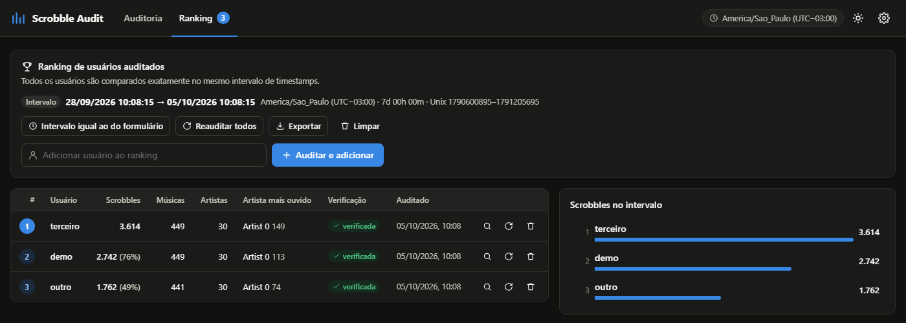

# Scrobble Audit

**Auditoria e análise de scrobbles do Last.fm por intervalo exato de data e hora.**
Responda perguntas como *"o que eu ouvi entre 08:00 e 13:00 de 05/10?"* ou *"em que horários essa música foi scrobblada?"* com precisão de segundo e contagem conferida contra a própria Last.fm.

[](LICENSE)


[](https://vercel.com/new/clone?repository-url=https%3A%2F%2Fgithub.com%2Fmacedo-kayki%2Fscrobble-audit&env=LASTFM_API_KEY&envDescription=API%20key%20da%20Last.fm%20%28fica%20s%C3%B3%20no%20servidor%29&envLink=https%3A%2F%2Fwww.last.fm%2Fapi%2Faccount%2Fcreate&project-name=scrobble-audit)


<sub>Captura com dados simulados.</sub>

---

## Sumário

- [Funcionalidades](#funcionalidades)
- [Como a precisão é garantida](#como-a-precisão-é-garantida)
- [Segurança da API key](#segurança-da-api-key)
- [Deploy na Vercel](#deploy-na-vercel)
- [Rodando localmente](#rodando-localmente)
- [Como usar](#como-usar)
- [Limitações conhecidas](#limitações-conhecidas)
- [Arquitetura](#arquitetura)
- [Testes](#testes)
- [Contribuindo](#contribuindo)
- [Licença](#licença)

## Funcionalidades

- **Qualquer intervalo, com segundos.** Os scrobbles são filtrados pelo timestamp real de cada um, não pelos períodos fixos da Last.fm ("7 dias", "1 mês").
- **Contagem verificada.** Ao final, o total coletado é comparado com o total oficial informado pela API, e o resultado aparece como *verificada*, *incompleta* ou *divergente*.
- **Timezone explícito.** Escolha qualquer timezone IANA (ex.: `America/Sao_Paulo (UTC−03:00)`). O intervalo é interpretado nele e todos os horários são exibidos nele, com horário de verão tratado corretamente.
- **Filtros:** busca livre, artista, música e álbum (contém ou exato, sem diferenciar maiúsculas e acentos), datas, janela de horário do dia (inclusive atravessando a meia-noite, como 22:00 → 02:00), dias da semana, duração da faixa, nº de reproduções no período e scrobbles muito próximos (< 30 s).
- **Todos os horários de uma música**, agrupados por dia e com distribuição por hora.
- **Visualizações** por scrobble ou agrupadas por música, artista ou álbum, com ordenação por horário, nome ou quantidade.
- **Estatísticas e gráficos:** totais, músicas, artistas e álbuns únicos, mais ouvidos (com empates), linha do tempo, distribuição por hora e por dia da semana, top artistas e top músicas.
- **Ranking de usuários** comparados **exatamente no mesmo intervalo**.
- **Exportação** em CSV e JSON (resultado filtrado, auditoria completa ou ranking).
- **Persistência local:** configurações, filtros, histórico, última auditoria e ranking ficam no `localStorage` do seu navegador e sobrevivem ao recarregar a página.
- Tratamento de usuário inexistente, perfil privado, limite da API (com retentativa e backoff automáticos), API fora do ar, falhas de rede e cancelamento.
- Tema claro/escuro, layout responsivo e navegação por teclado.


<sub>Captura com dados simulados.</sub>

## Como a precisão é garantida

O método `user.getRecentTracks` da Last.fm devolve no máximo 200 scrobbles por página, do mais novo para o mais antigo. Paginar por número de página falha de dois jeitos: se um scrobble novo chega durante a busca, as páginas se deslocam e um item é pulado; e a documentação não diz se `from`/`to` são inclusivos. O Scrobble Audit resolve assim:

1. **Janela com folga de 1 s.** A API é consultada com `from − 1` e `to + 1`, e o intervalo exato (`início ≤ ts ≤ fim`) é aplicado localmente. O resultado fica correto qualquer que seja a semântica da API.
2. **Cursor de tempo, não número de página.** Cada requisição pede `to = (scrobble mais antigo já visto) + 1`. Scrobbles que chegam durante a auditoria, inclusive offline com data retroativa, não deslocam nada.
3. **Deduplicação que preserva duplicatas legítimas.** O segundo de fronteira é relido de propósito. Para cada scrobble idêntico, guarda-se a maior quantidade vista em *uma única* resposta: releituras não duplicam, e dois scrobbles idênticos legítimos não se perdem.
4. **Segundos lotados.** Se um único segundo tiver 200 scrobbles ou mais (importações), ele é paginado isoladamente.
5. **Paralelismo seguro.** Volumes grandes são divididos em fatias de tempo disjuntas percorridas em paralelo, sob um limite global de ≈4 requisições/s.
6. **Verificação e reconciliação.** No fim, a contagem é conferida com um novo total oficial. Se faltar algo, a janela é percorrida de novo, até 2 vezes.

Cada um desses cenários tem teste automatizado com uma API simulada. O algoritmo também foi validado contra a API real: uma auditoria de 10 anos (23.903 scrobbles) bateu exatamente com o total da Last.fm.

> **Nada é inventado.** Campos que a API não fornece (álbum, MBIDs, imagem, duração) aparecem como "não informado" na tela, vazios no CSV e `null` no JSON.

## Segurança da API key

Num app que roda no navegador, qualquer key que o navegador use fica visível no "Inspecionar" (aba Network, código-fonte, `localStorage`), e ofuscar não resolve. Por isso **a key nunca vai para o frontend**: o navegador chama `/api/lastfm` sem key, e um proxy no servidor acrescenta a key antes de repassar à Last.fm.

| Ambiente | Proxy | Onde a key fica |
|---|---|---|
| Vercel (produção) | [`api/lastfm.js`](api/lastfm.js) — Vercel Function | variável de ambiente `LASTFM_API_KEY` |
| Local | [`servidor.py`](servidor.py) | arquivo `.env` (no `.gitignore`) |

Os dois proxies seguem as mesmas regras:

- aceitam só os métodos de leitura que o app usa (`user.getrecenttracks`, `user.getinfo`, `track.getinfo`);
- repassam só parâmetros conhecidos e descartam qualquer `api_key` enviada pelo cliente;
- nunca devolvem a key nas respostas;
- não enviam cabeçalhos CORS e recusam requisições *cross-site* do navegador, então outros sites não conseguem usar o seu proxy.

O site é servido com uma **Content Security Policy** restritiva (veja [`vercel.json`](vercel.json)): só scripts do próprio domínio, sem `eval` e sem scripts inline. Os nomes de músicas, que vêm de terceiros, são sempre escapados antes de entrar no HTML.

> **Sobre abuso de cota.** As regras acima impedem o uso do proxy por *outros sites*, mas um script fora do navegador ainda consegue chamá-lo e consumir a cota da sua key (a key em si continua invisível). Para instâncias públicas, considere uma regra de *rate limiting* no **Vercel Firewall**.

Em **Configurações**, o visitante pode colar a **própria** key. Nesse caso ela é usada diretamente e fica visível só no navegador dele.

## Deploy na Vercel

O site é estático e o proxy é uma única Vercel Function. Não há etapa de build.

**Com um clique:** use o botão **Deploy na Vercel** no topo desta página e informe sua `LASTFM_API_KEY` quando for pedida.

**Manualmente:**

1. Obtenha uma API key em <https://www.last.fm/api/account/create>. O *Callback URL* pode ficar vazio, e o *shared secret* não é usado.
2. Na Vercel: **Add New → Project** e importe este repositório.
3. Em **Framework Preset**, escolha **Other**. Deixe *Build Command* e *Output Directory* vazios.
4. Em **Environment Variables**, adicione `LASTFM_API_KEY` com a sua key.
5. Clique em **Deploy**.

O frontend já aponta para `/api/lastfm` por padrão ([`site.config.js`](site.config.js)), então não há mais nada a configurar. Se trocar a key depois, faça um *redeploy* para ela valer.

> Para hospedar em um serviço **só estático** (GitHub Pages, Netlify sem functions etc.), defina `proxyUrl: ''` em `site.config.js`. Assim cada visitante informa a própria key em Configurações.

## Rodando localmente

Requisitos: **Python 3.8+**. Nenhuma outra dependência.

```bash
git clone https://github.com/macedo-kayki/scrobble-audit.git
cd scrobble-audit
cp .env.example .env        # edite e preencha LASTFM_API_KEY=...
python servidor.py          # http://localhost:5173  (use --open para abrir o navegador)
```

O `servidor.py` serve o site e o proxy em `/api/lastfm`, com os mesmos cabeçalhos de segurança da produção. O comportamento local é idêntico ao da Vercel.

> Abrir o `index.html` com duplo clique (`file://`) **não funciona**, porque o navegador bloqueia ES modules nesse modo. Use sempre um servidor.

## Como usar

1. **Auditoria.** Informe o usuário, o início e o fim (com segundos, se quiser) e o timezone, ou use um atalho (Hoje, Ontem, Últimas 24h…). A linha abaixo do formulário mostra o intervalo exato em horário local e em Unix.
2. **Auditar.** O progresso mostra quantos scrobbles já foram baixados do total esperado. Acima de 20 mil o app pede confirmação, e é possível cancelar a qualquer momento.
3. **Verificação.** O cartão verde confirma que a contagem bate com a Last.fm. Em **Detalhes da auditoria** aparecem a janela consultada, os totais, as requisições e o método usado.
4. **Filtros.** Use o painel à esquerda. Estatísticas e gráficos passam a refletir o conjunto filtrado.
5. **Detalhes.** Clique em um scrobble para ver timestamp Unix, UTC e horário local, além do intervalo para o anterior e o próximo. Clique em uma música para ver **todos os horários** em que ela foi scrobblada.
6. **Durações** (opcional). A Last.fm não envia duração junto com os scrobbles. **Buscar durações** consulta `track.getInfo` uma vez por música única (com cache local) e habilita o filtro de duração.
7. **Exportar.** CSV ou JSON, filtrado ou completo. Em Configurações dá para trocar o separador do CSV (`;` funciona melhor no Excel em português).
8. **Ranking.** Clique em *Adicionar ao ranking* ou use a aba **Ranking**. Todos os usuários são auditados no mesmo intervalo, e dá para reauditar, remover e exportar.

**Intervalo e timezone.** O fim é **inclusivo** por padrão (`08:00–13:00` inclui um scrobble às `13:00:00`); em Configurações ele pode virar exclusivo, útil para encadear intervalos sem sobreposição. Se o horário digitado não existe por causa do horário de verão, o app avisa e usa o primeiro instante válido seguinte. Em horários ambíguos, usa a primeira ocorrência.

## Limitações conhecidas

- **Perfis privados.** Se o usuário ocultou o histórico, a Last.fm recusa a consulta.
- **Limite da API.** Todos os visitantes de uma instância compartilham a mesma key. Sob uso intenso, a Last.fm pode limitar requisições; o app espera e tenta de novo automaticamente.
- **`localStorage` ≈ 5 MB.** Auditorias muito grandes podem não caber. O app avisa, mantém o resultado em memória e sugere exportar.
- **Scrobbles excluídos durante a auditoria** podem deixar a contagem coletada maior que o novo total. O app sinaliza como *divergente*.
- **Durações** vêm do cadastro da Last.fm e nem sempre existem ou correspondem à versão ouvida.
- **CSV:** valores que começam com `=`, `+`, `-`, `@`, tab ou CR recebem um `'` na frente, para evitar injeção de fórmulas no Excel/Sheets. O JSON mantém os valores originais.

## Privacidade

As auditorias, os filtros e o ranking ficam **só no seu navegador**. O proxy não armazena nada: ele apenas repassa as consultas (username e intervalo) à Last.fm. Os logs da plataforma de hospedagem podem registrar as URLs dessas requisições.

## Arquitetura

HTML, CSS e JavaScript puros (ES modules), sem framework, sem build e sem dependências em runtime. A lógica de negócio fica isolada do DOM e é testável no Node.

```
index.html                  shell da aplicação
site.config.js              configuração pública (URL do proxy; nunca contém segredos)
api/lastfm.js               proxy da Last.fm (Vercel Function)
servidor.py                 servidor local: site + proxy (key no .env)
vercel.json                 cabeçalhos de segurança (CSP etc.)
assets/                     estilos e ícone
src/
  main.js                   bootstrap: registra fontes e monta as views
  config.js                 constantes e defaults
  core/                     lógica pura, sem DOM
    time.js                 timezones, conversões e formatação
    model.js                modelo Scrobble e deduplicação exata
    audit.js                montagem do intervalo e execução da auditoria
    filters.js · stats.js   filtros, ordenação, agrupamento e estatísticas
    export.js · storage.js  CSV/JSON e localStorage
    rateLimiter.js · errors.js
  sources/
    registry.js             interface ScrobbleSource
    lastfm/client.js        HTTP, retentativas e erros da Last.fm
    lastfm/source.js        algoritmo de busca exata por intervalo
  ui/                       estado, componentes e views
tests/                      testes (node --test) e smoke.html
docs/                       capturas de tela do README
```

### Adicionando outra fonte de scrobbles

A arquitetura aceita outras fontes (ListenBrainz, Libre.fm, Maloja…). Implemente a interface descrita em [`src/sources/registry.js`](src/sources/registry.js):

```js
{
  id: 'listenbrainz',
  name: 'ListenBrainz',
  capabilities: { userInfo: true, trackDuration: false },
  profileUrl: (username) => `https://listenbrainz.org/user/${username}`,
  async getUser(username, { signal }) { /* -> UserInfo */ },
  async countScrobbles({ user, from, to, signal }) { /* -> number */ },
  // TODOS os scrobbles com from <= ts <= to (segundos), do mais novo ao mais antigo,
  // já normalizados para o modelo de src/core/model.js.
  async fetchScrobbles({ user, from, to, signal, onProgress, confirmLarge }) {
    return { scrobbles, verification, requests, retries };
  },
}
```

Registre a fonte em `src/main.js` com `registerSource(...)` e converta os erros para `AppError`. Filtros, estatísticas, exportação e ranking funcionam sem alterações.

## Testes

```bash
npm test        # node --test "tests/*.test.js"  — Node 20+
```

A suíte cobre timezones e horário de verão, filtros, estatísticas, exportação, o algoritmo de paginação (bordas inclusivas e exclusivas, inserções durante a busca, mais de 200 scrobbles no mesmo segundo, duplicatas, páginas vazias, 12 mil scrobbles em paralelo) e o proxy (a key nunca volta ao cliente; métodos e usos cross-site não autorizados são bloqueados).

Para ver a interface sem API key, rode `python servidor.py` e abra `/tests/smoke.html?run=audit`. Essa página usa **dados simulados** e mostra uma faixa de aviso. Outros cenários: `?run=ranking`, `notfound`, `ratelimit` e `empty`, combináveis com `&theme=dark`.

## Contribuindo

Issues e pull requests são bem-vindos.

- Mantenha a lógica de negócio em `src/core/`, sem acesso ao DOM, e acompanhe mudanças com testes em `tests/`.
- Todo conteúdo dinâmico entra no HTML pelo template `html` de `src/ui/dom.js`, que escapa os valores.
- Nunca commite `.env` nem coloque API keys em arquivos do frontend.
- Rode `npm test` antes de abrir o PR.

## Licença

[MIT](LICENSE).

O Scrobble Audit não tem afiliação com a Last.fm. Os dados são obtidos pela [Last.fm API](https://www.last.fm/api), sujeita aos [termos de uso da API](https://www.last.fm/api/tos).
